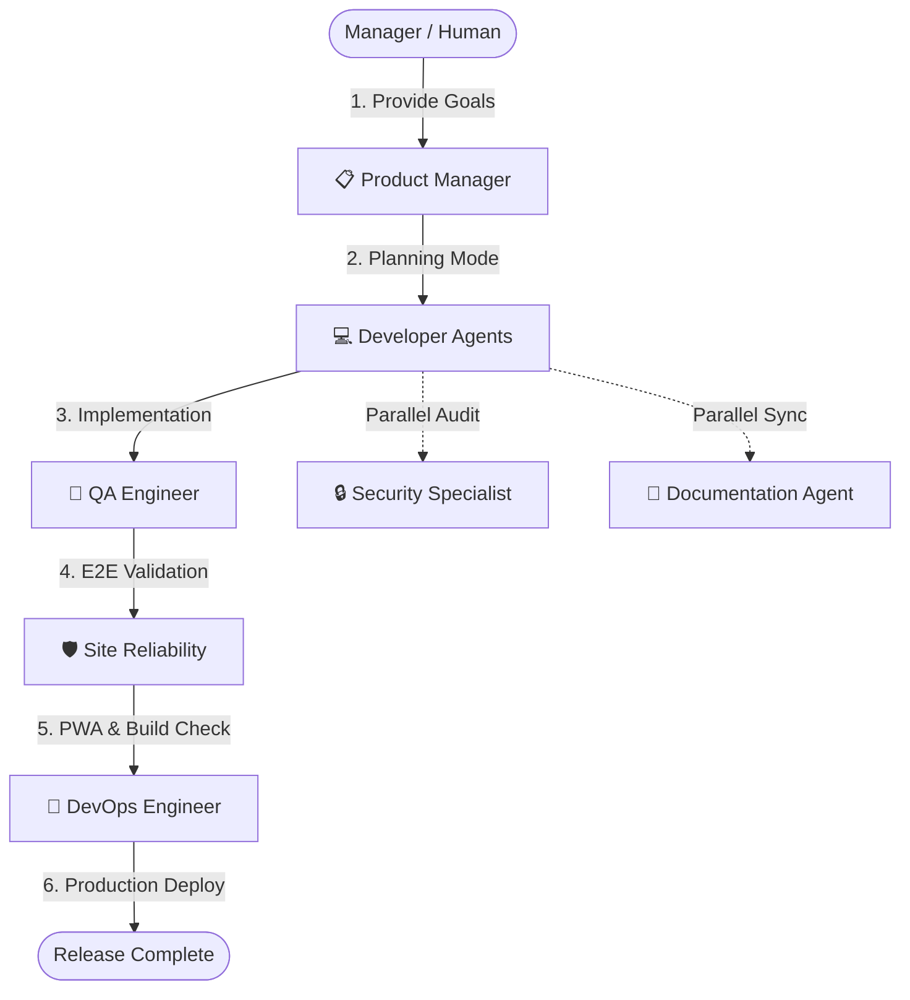

# Standardized Agentic Workflow: Greenbird Homestead PWA

This document outlines the operational guidelines, deployment procedures, script usage rules, and database security policies governing the multi-agent software development system for Greenbird Homestead.

---

## 1. Multi-Agent Development Lifecycle

The system operates under a distributed multi-agent architecture where agents carry out specialized tasks. No single agent manages the entire process; coordination and hand-offs are mandatory.

---

## 2. Deployment Paths & Script-Usage Policies

To prevent compilation failures, regressions, and layout breaks, agents must adhere to the following scripts:

### A. Local Development & Testing (Mandatory)
* **Command**: `npm run dev`
* **Purpose**: Running the next.js development server on `http://localhost:3000`.
* **Policy**: Used by UI/UX and Backend agents to review layouts and test local reactivity.

### B. Automated Testing & Emulator Mandate (Zero-Tolerance)
* **Command**: `npm run test`
* **Script Map**: `firebase emulators:exec "npx tsx scripts/create-test-users.ts && playwright test"`
* **Policy**: 
  * E2E testing must **never** touch the live production Firebase environment (`greenbird-56584`).
  * All mutations, auth states, and test transactions must run in the isolated local Emulator environment.
  * Running test suites requires verification that local emulator ports (8080, 9099, 9199) are available.

### C. Standard Release Pipeline (Recommended)
* **Command**: `npm run deploy:full "[Summary]"`
* **Script Map**: `node scripts/full-deploy.js`
* **Policy**:
  * Mandatory for all feature implementations.
  * **Execution Pipeline**:
    1. **Clean**: Invokes `npm run cleanup:test-data` to clear test remnants.
    2. **Bump**: Bumps the patch version in [package.json](file:///Users/santoshbastola/Desktop/Greenbirdecom/package.json).
    3. **Notes**: Automatically appends the summary to [RELEASE_NOTES.md](file:///Users/santoshbastola/Desktop/Greenbirdecom/RELEASE_NOTES.md).
    4. **Git**: Commits and pushes the changes.
    5. **Test**: Runs the entire Playwright test suite.
    6. **Build**: Compiles Next.js PWA static assets and verifies `sw.js` and `manifest.json` generation.
    7. **Functions**: Compiles cloud functions in the `functions/` directory.
    8. **Deploy**: Deploys to production Firebase Hosting and Functions.

### D. Quick Release / Hotfix Path (Restricted)
* **Command**: `npm run deploy:quick`
* **Script Map**: `node scripts/quick-deploy.js`
* **Policy**:
  * Bypasses tests, version bumping, and git pushing.
  * **Use Case**: Restricted to urgent UI hotfixes or minor copywriting corrections.
  * **Restriction**: Requires explicit human approval. Cannot be executed autonomously for database, routing, or function updates.

---

## 3. Database Security & Protection Guardrails

To prevent data corruption, accidental data loss, or configuration drift, the following policies are hardcoded into agent guidelines:

### A. Production Database Protection
1. **No Direct Mutation**: Agents are strictly forbidden from executing direct console command mutations, `delete` queries, or raw document drops on the production Firestore instance.
2. **Double-Signoff for Migration Scripts**: If a task requires a schema change or script-based database migration, the migration script must first be run and verified in the emulator. Applying it to production requires user review and sign-off.
3. **Environment Segregation**: Production credentials or administrative keys must never be committed to files or exported to the client.

### B. Security Rules Drift Prevention
* Any updates to Security Rules must be written inside [storage.rules](file:///Users/santoshbastola/Desktop/Greenbirdecom/storage.rules) or a Version Control Firestore rules configuration.
* Direct console edits of Security Rules are banned. All rules updates must go through the standard Git pipeline.

---

## 4. Workflows & State Synchronization

* **Planning Mode**: Before starting any feature implementation, the team must write `implementation_plan.md` and request feedback. No code changes are allowed until the plan is approved.
* **Tracking Progress**: During execution, progress must be tracked live in `task.md`.
* **Deployment Validation**: DevOps must not dispatch builds unless QA has signed off on E2E tests passing.
