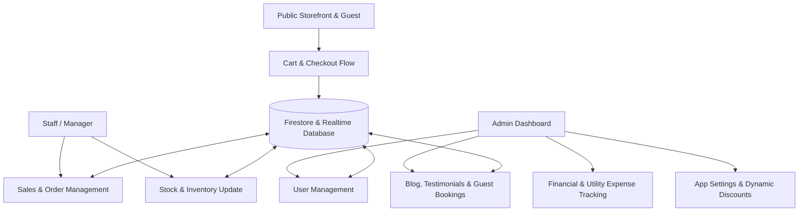

# Software Requirement Specification (SRS)

**Project Title:** E-Commerce & Business Operations Platform (Greenbird Web)  
**Document Type:** Modular Software Requirement Specification (Reusable Template)  
**Version:** 1.1.0  

---

## 1. System Overview & Architecture

### 1.1 Objective & Scope
The platform is a multi-tenant ready Progressive Web Application (PWA) designed for modern retail, direct-to-consumer e-commerce, and farm/inventory operations management. It provides end-to-end management for storefront ordering, inventory tracking, multi-channel payment processing, customer communication, expense/utility tracking, team task management, and administrative reports.

### 1.2 User Roles & Access Control
The application operates on Role-Based Access Control (RBAC):
- **Customer / Guest**: Public browsing, cart management, self-checkout, order history, profile management, booking requests, and real-time notifications.
- **Manager / Staff**: Restricted administrative access for processing orders, managing inventory stock updates, logging utility bills, executing task assignments, and messaging customers.
- **Admin**: Full access to all modules, including system configuration, global discount rules, user management, audit logs, data exports, and financial reporting.

---

## 2. Core Feature Specifications & Data Fields

---

### 2.1 Authentication & User Access Module

#### 2.1.1 Features
- **Multi-Method Login**: Google One-Tap / OAuth, Email & Magic Link, Phone Number Authentication.
- **Session Management**: Persistent JWT-based authentication tokens paired with client-side state managers (Zustand/Context).
- **Profile Management**: Primary & alternate address management, geolocation tagging, and Cloud Messaging (FCM) token registration.

#### 2.1.2 Entity & Data Fields (`User`)
| Field Name | Data Type | Requirement | Description / Constraints |
| :--- | :--- | :--- | :--- |
| `id` | String | Required | Unique user identifier (Auth UID) |
| `name` | String | Required | Full display name |
| `email` | String | Optional | Primary email address |
| `phoneNumber` | String | Optional | Primary phone number (with country code) |
| `role` | Enum | Required | Options: `admin` \| `manager` \| `customer` |
| `partnerType` | Enum | Optional | Options: `customer` \| `vendor` |
| `address` | String | Optional | Primary textual address |
| `addresses` | Array[String] | Optional | List of saved user delivery addresses |
| `deliveryLocation` | Object | Optional | `{ lat: Number, lng: Number, address: String }` |
| `totalTransactionAmount` | Number | Optional | Cumulative financial volume (for analytics) |
| `isActive` | Boolean | Optional | Soft-delete / active status flag |
| `remarks` | String | Optional | Internal admin notes regarding user |
| `fcmToken` | String | Optional | Firebase Cloud Messaging token for push notifications |
| `createdAt` | ISO DateTime | Required | Profile creation timestamp |

---

### 2.2 Public Storefront & Shopping Cart Module

#### 2.2.1 Features
- **Catalog Navigation**: Filter by Category, Tag, and Business Type (`livestock`, `crop`, `product`, `asset`).
- **Dynamic Pricing & Discounts**: Real-time display of regular prices, flash sales, unit-based pricing (e.g. per kg, per crate), and availability tags.
- **Persistent Shopping Cart**: Cross-session cart retention, quantity calculation, weight adjustment, stock availability check, and instant breakdown of savings.
- **Guest & Authenticated Checkout**: Support for instant order placement with automated delivery fee computation and threshold-based free delivery rules.

#### 2.2.2 Entity & Data Fields (`Product`, `CartItem`, `Category`, `Unit`)

##### A. Product Data Fields (`Product`)
| Field Name | Data Type | Requirement | Description / Constraints |
| :--- | :--- | :--- | :--- |
| `id` | String | Required | Unique product identifier |
| `name` | String | Required | Product title |
| `description` | String | Optional | Detailed HTML/Markdown product text |
| `businessType` | Enum | Required | Options: `livestock` \| `crop` \| `product` \| `asset` |
| `unit` | String | Required | Base inventory stock unit (e.g., `kg`, `pcs`, `crate`) |
| `priceUnit` | String | Required | Unit used for billing (e.g., `kg`, `pcs`) |
| `currentPrice` | Number | Required | Base selling price per unit |
| `currentStock` | Number | Required | Available quantity in stock |
| `images` | Array[String] | Required | List of image URLs |
| `categoryId` | String | Optional | Reference to Category entity |
| `categoryName` | String | Optional | Cached category label |
| `isAvailableForSale` | Boolean | Required | Controls visibility on public storefront |
| `isFeatured` | Boolean | Optional | Highlights product in featured banners |
| `showInApp` | Boolean | Optional | Show/Hide product flag for customer app |
| `tags` | Array[String] | Optional | Search keywords & tags |
| `relatedProductIds` | Array[String] | Optional | Recommendation IDs |
| `discount` | Object | Optional | Product discount structure (see Section 2.5) |
| `createdAt` | ISO DateTime | Required | Creation timestamp |
| `createdBy` | String | Required | User UID of creator |
| `updatedAt` | ISO DateTime | Optional | Modification timestamp |

##### B. Shopping Cart Item Fields (`CartItem`)
| Field Name | Data Type | Requirement | Description / Constraints |
| :--- | :--- | :--- | :--- |
| `productId` | String | Required | Reference to Product `id` |
| `productName` | String | Required | Snapshot product title |
| `price` | Number | Required | Discounted selling unit price |
| `originalPrice` | Number | Optional | Original pre-discount price |
| `discount` | Number | Optional | Flat discount per unit |
| `quantity` | Number | Required | Number of units ordered |
| `weight` | Number | Optional | Quantity weight when unit !== priceUnit |
| `unit` | String | Required | Stock unit identifier |
| `priceUnit` | String | Optional | Pricing unit identifier |
| `availableStock` | Number | Required | Stock check snapshot |
| `imageUrl` | String | Optional | Thumbnail URL |

##### C. Category & Unit Measurement Entities (`Category`, `Unit`)
| Field Name | Data Type | Requirement | Description / Constraints |
| :--- | :--- | :--- | :--- |
| `Category.id` | String | Required | Unique category identifier |
| `Category.name` | String | Required | Category title |
| `Category.description` | String | Optional | Category description |
| `Category.businessType` | Enum | Optional | `livestock` \| `crop` \| `product` \| `asset` |
| `Category.isActive` | Boolean | Required | Active status toggle |
| `Unit.id` | String | Required | Measurement unit identifier |
| `Unit.name` | String | Required | Display unit label (e.g., "Kg", "Crate", "Litre") |
| `Unit.type` | Enum | Required | Options: `stock` \| `price` \| `both` |
| `Unit.allowDecimals` | Boolean | Required | Flag allowing decimal quantities (e.g. 1.5 kg) |

---

### 2.3 Order & Sales Management Module

#### 2.3.1 Features
- **Transaction Processing**: Unified pipeline for online e-commerce sales and direct cash/manual POS transactions.
- **Order Lifecycle States**: Real-time status transitions: `open` -> `accepted` -> `delivered` (or `cancelled`).
- **Payment Handling**: Full payment, partial payment log tracking, cash, and online remittance logs.
- **Delivery Management**: Geolocation mapping (`lat`/`lng`), delivery address records, and expected delivery timeframes.
- **Order Audit Trail**: Immutable step-by-step logs tracking status changes and order item adjustments.

#### 2.3.2 Entity & Data Fields (`TransactionRecord`, `SalesItem`, `PaymentRecord`)

##### A. Transaction Record (`TransactionRecord`)
| Field Name | Data Type | Requirement | Description / Constraints |
| :--- | :--- | :--- | :--- |
| `id` | String | Required | Unique transaction/order identifier |
| `billNo` | String | Required | Human-readable sequential bill/invoice number |
| `type` | Enum | Required | Options: `Sale` \| `Purchase` |
| `items` | Array[SalesItem] | Required | Array of purchased items |
| `customerId` | String | Optional | Registered user reference ID |
| `partyName` | String | Required | Name of customer or vendor |
| `customerPhone` | String | Optional | Contact phone number |
| `date` | ISO DateTime | Required | Transaction date |
| `discount` | Number | Required | Total order-level discount amount |
| `discountDetails` | String | Optional | Description of discounts applied |
| `deliveryFee` | Number | Optional | Shipping / handling charge |
| `deliveryAddress` | String | Optional | Full physical delivery address |
| `deliveryInstructions` | String | Optional | Special instructions for delivery |
| `expectedDeliveryDate` | ISO DateTime | Optional | Promised delivery date |
| `expectedDeliveryTime` | String | Optional | Promised delivery window (e.g. "Morning 9-11 AM") |
| `deliveryLocation` | Object | Optional | `{ lat: Number, lng: Number, address: String }` |
| `paymentStatus` | Enum | Required | Options: `Pending` \| `PaidCash` \| `PaidOnline` \| `PartialCash` \| `PartialOnline` |
| `status` | Enum | Required | Options: `open` \| `accepted` \| `delivered` \| `cancelled` |
| `cancellationReason` | String | Optional | Reason recorded on cancellation |
| `paidAmount` | Number | Required | Total accumulated paid amount |
| `payments` | Array[PaymentRecord]| Required | Log of partial/full payments received |
| `soldBy` | String | Required | Sales representative or system channel |
| `enteredBy` | String | Required | User UID who registered the transaction |
| `entryTimestamp` | ISO DateTime | Required | System entry timestamp |
| `documentUrls` | Array[String] | Optional | Attachment links (receipts, bills) |
| `logs` | Array[OrderLog] | Optional | Audit activity history |

##### B. Sales Item Detail (`SalesItem`)
| Field Name | Data Type | Requirement | Description / Constraints |
| :--- | :--- | :--- | :--- |
| `productId` | String | Required | Product reference ID |
| `productName` | String | Required | Snapshot product name |
| `businessType` | Enum | Required | `livestock` \| `crop` \| `product` \| `asset` |
| `quantity` | Number | Required | Item count |
| `weight` | Number | Optional | Item weight in kg (if applicable) |
| `unit` | String | Required | Base stock unit |
| `priceUnit` | String | Required | Unit applied for total billing |
| `pricePerUnit` | Number | Required | Applied price per unit |
| `originalPrice` | Number | Optional | List price prior to discount |
| `discount` | Number | Optional | Per-unit discount |
| `totalPrice` | Number | Required | Final computed total line price |

##### C. Payment Record (`PaymentRecord`)
| Field Name | Data Type | Requirement | Description / Constraints |
| :--- | :--- | :--- | :--- |
| `amount` | Number | Required | Amount paid in this transaction installment |
| `date` | ISO DateTime | Required | Payment receipt date |
| `note` | String | Optional | Payment transaction reference or payment notes |
| `enteredBy` | String | Optional | Admin/Staff user who recorded the payment |

---

### 2.4 Inventory & Stock Tracking Module

#### 2.4.1 Features
- **Stock Audit Logs**: Comprehensive logging of inventory changes (`initial`, `add`, `remove`, `set`, `sale`, `purchase`).
- **Historical Price Tracking**: Historical log of unit selling prices and maximum retail prices over time.
- **Stock Alert Metrics**: Monitoring of active stock levels, egg/livestock counts, and automated low-stock warnings.

#### 2.4.2 Entity & Data Fields (`StockHistoryEntry`, `PriceHistoryEntry`)
| Field Name | Data Type | Requirement | Description / Constraints |
| :--- | :--- | :--- | :--- |
| `id` | String | Required | Unique stock log ID |
| `productId` | String | Required | Product reference ID |
| `oldStock` | Number | Required | Quantity before operation |
| `newStock` | Number | Required | Quantity after operation |
| `changeAmount` | Number | Required | Delta change (+ or -) |
| `actionType` | Enum | Required | Options: `initial` \| `add` \| `remove` \| `set` \| `sale` \| `purchase` |
| `date` | ISO DateTime | Required | Operation timestamp |
| `changedBy` | String | Required | User UID responsible for modification |
| `note` | String | Optional | Reason for stock adjustment |

---

### 2.5 Dynamic Discount & App Settings Module

#### 2.5.1 Features
- **Tiered Storewide Discounts**: Percentage-based app promotion configuration with minimum spending limits and valid date windows.
- **First-Order Incentives**: Flat discount configuration for first *X* orders per customer.
- **Delivery Fee Rules**: Base delivery fee configuration with threshold for free delivery eligibility.

#### 2.5.2 Entity & Data Fields (`AppSettings`)
| Field Name | Data Type | Requirement | Description / Constraints |
| :--- | :--- | :--- | :--- |
| `deliveryFee` | Number | Required | Base delivery cost |
| `freeDeliveryThreshold` | Number | Required | Minimum order amount to qualify for free shipping |
| `enableAppDiscount` | Boolean | Required | Toggle storewide percentage promotion |
| `appDiscountPercentage` | Number | Required | Storewide discount rate (%) |
| `minAppDiscount` | Number | Required | Minimum subtotal required for discount |
| `appDiscountStartDate` | ISO Date String | Optional | Start timestamp of promo |
| `appDiscountEndDate` | ISO Date String | Optional | Expiry timestamp of promo |
| `enableFirstOrderDiscount` | Boolean | Required | Toggle first-time buyer discount |
| `firstOrderDiscountAmount` | Number | Required | Flat discount amount (e.g. Rs 100) |
| `firstOrderCountThreshold` | Number | Required | Applied to first X orders (e.g. 1) |
| `whatsappBotNumber` | String | Optional | Official automated WhatsApp messaging contact number |

---

### 2.6 Operations, Energy Bills & Task Module

#### 2.6.1 Features
- **Utility Expense Tracking**: Log expenses for electricity, water, gas, and food supplies with billing cycles, meter reading dates, due dates, and partial payments.
- **Task Management**: Assignment of operational tasks categorized by priority (`urgent`, `high`, `medium`, `low`) and repetition rules (`daily`, `weekly`, `monthly`).

#### 2.6.2 Entity & Data Fields (`EnergyBill`, `TaskItem`)

##### A. Utility & Energy Expense Fields (`EnergyBill`)
| Field Name | Data Type | Requirement | Description / Constraints |
| :--- | :--- | :--- | :--- |
| `id` | String | Required | Unique expense log ID |
| `type` | Enum | Required | Options: `electricity` \| `water` \| `gas` \| `food` |
| `month` | String | Required | Billing month name (e.g. "Baisakh") |
| `year` | Number | Required | Billing year (BS or AD) |
| `amount` | Number | Required | Total bill amount |
| `paidAmount` | Number | Required | Amount settled to date |
| `paymentStatus` | Enum | Required | Options: `Pending` \| `PaidCash` \| `PaidOnline` \| `PartialCash` \| `PartialOnline` |
| `payments` | Array[PaymentRecord]| Optional | Payment history log |
| `meterReadingDate` | ISO DateTime | Optional | Reading verification date |
| `dueDate` | ISO DateTime | Optional | Payment due deadline |
| `purchaseDate` | ISO DateTime | Optional | Date of purchase (e.g. Gas cylinders) |
| `remarks` | String | Optional | Additional notes or receipt memo |
| `documentUrls` | Array[String] | Optional | Receipts/Invoices image links |

##### B. Task Item Fields (`TaskItem`)
| Field Name | Data Type | Requirement | Description / Constraints |
| :--- | :--- | :--- | :--- |
| `id` | String | Required | Internal system task ID |
| `taskId` | String | Required | Display task code |
| `title` | String | Required | Task summary title |
| `description` | String | Optional | Comprehensive instructions |
| `status` | Enum | Required | Options: `open` \| `inProgress` \| `done` |
| `priority` | Enum | Required | Options: `urgent` \| `high` \| `medium` \| `low` |
| `repetition` | Enum | Required | Options: `doesNotRepeat` \| `daily` \| `weekdays` \| `weekly` \| `monthly` \| `yearly` |
| `assignedTo` | String | Optional | User UID assigned to task |
| `createdBy` | String | Optional | User UID of task creator |
| `dueDate` | ISO DateTime | Optional | Due completion deadline |
| `completedDate` | ISO DateTime | Optional | Task finish timestamp |

---

### 2.7 Multi-Channel Notifications & Communication Module

#### 2.7.1 Features
- **In-App Messaging**: Customer notification center for tracking order status updates, promotional offers, and system alerts.
- **WhatsApp Webhook Integration**: Automated transactional triggers via WhatsApp templates for order placement, confirmation, and dispatch.
- **Admin Broadcast Center**: Mass messaging to users based on role, segment, or specific notification channels.

#### 2.7.2 Entity & Data Fields (`Notification`, `BroadcastHistory`)
| Field Name | Data Type | Requirement | Description / Constraints |
| :--- | :--- | :--- | :--- |
| `id` | String | Required | Unique notification ID |
| `targetUserId` | String | Required | Recipient user UID |
| `title` | String | Required | Notification title |
| `message` | String | Required | Body message text |
| `type` | Enum | Required | Options: `info` \| `success` \| `warning` \| `error` |
| `channels` | Array[Enum] | Optional | Options: `in-app` \| `whatsapp` \| `email` \| `push` |
| `isRead` | Boolean | Required | Unread/read status flag |
| `relatedEntityId` | String | Optional | Linked Entity ID (Order ID, Task ID) |
| `relatedEntityType` | Enum | Optional | Options: `transaction` \| `task` \| `alert` \| `offer` |
| `route` | String | Optional | In-app relative URL route navigation link |
| `validUntil` | ISO DateTime | Optional | Expiry timestamp for temporal offers |
| `whatsappTemplate` | String | Optional | Target registered WhatsApp template key |
| `createdAt` | ISO DateTime | Required | Sent timestamp |

---

### 2.8 Content Management, Bookings & Community Engagement Module

#### 2.8.1 Features
- **Blog Publishing Engine**: Publish articles, news updates, and agricultural guides with categories, read times, view counts, and rich media thumbnails.
- **Homestay & Event Booking Requests**: Customer booking requests for farm visits, staycations, or agricultural experiences with guest counts, check-in/out dates, and status workflows (`pending`, `confirmed`, `cancelled`, `completed`).
- **Testimonial & Activity Feed Management**: Admin-curated publishing of customer reviews, social profile references, and daily farm activity updates.

#### 2.8.2 Entity & Data Fields (`BlogPost`, `Booking`, `FarmActivity`, `Testimonial`)

##### A. Blog Post Entity (`BlogPost`)
| Field Name | Data Type | Requirement | Description / Constraints |
| :--- | :--- | :--- | :--- |
| `id` | String | Required | Unique blog post identifier |
| `title` | String | Required | Article title |
| `slug` | String | Required | URL-friendly slug path |
| `excerpt` | String | Required | Short summary snippet for listing cards |
| `content` | String | Required | Full HTML / Markdown body content |
| `author` | String | Required | Author display name |
| `categories` | Array[String] | Required | List of associated category tags |
| `imageUrl` | String | Required | Main cover image link |
| `readTime` | Number | Required | Estimated reading duration in minutes |
| `published` | Boolean | Required | Visibility toggle |
| `views` | Number | Required | Accumulated page view counter |
| `date` | ISO DateTime | Required | Publication date |

##### B. Guest Booking Request Entity (`Booking`)
| Field Name | Data Type | Requirement | Description / Constraints |
| :--- | :--- | :--- | :--- |
| `id` | String | Required | Unique reservation request ID |
| `customerId` | String | Optional | User UID if signed in |
| `name` | String | Required | Full contact name |
| `email` | String | Required | Email address for confirmation |
| `phone` | String | Required | Contact phone number |
| `checkInDate` | ISO DateTime | Required | Arrival date |
| `checkOutDate` | ISO DateTime | Required | Departure date |
| `guests` | Number | Required | Number of attendees / guests |
| `specialRequests` | String | Optional | Custom request notes |
| `status` | Enum | Required | Options: `pending` \| `confirmed` \| `cancelled` \| `completed` |
| `createdAt` | ISO DateTime | Required | Reservation submission date |

##### C. Farm Activity & Testimonial Entities (`FarmActivity`, `Testimonial`)
| Field Name | Data Type | Requirement | Description / Constraints |
| :--- | :--- | :--- | :--- |
| `FarmActivity.id` | String | Required | Activity post ID |
| `FarmActivity.title` | String | Required | Activity title |
| `FarmActivity.description` | String | Required | Activity details |
| `FarmActivity.imageUrl` | String | Required | Primary media cover URL |
| `FarmActivity.media` | Array[Object] | Optional | List of `{ url: String, type: 'image' | 'video' }` |
| `FarmActivity.isPublished` | Boolean | Required | Display status toggle |
| `Testimonial.id` | String | Required | Review ID |
| `Testimonial.name` | String | Required | Customer reviewer name |
| `Testimonial.photoUrl` | String | Required | Profile avatar photo URL |
| `Testimonial.content` | String | Required | Review text |
| `Testimonial.customerProfileUrl` | String | Optional | Social media link of reviewer |
| `Testimonial.isPublished` | Boolean | Required | Moderation status toggle |

---

## 3. Non-Functional Requirements & Technical Specifications

### 3.1 Security & Compliance
- **Data Protection**: Client API communication over HTTPS/TLS 1.3.
- **Credential Storage**: API Keys, Service Account JSONs, and Webhook Secrets must remain strictly server-side (Cloud Functions runtime environment).
- **Database Rules**: Strict Firestore security rules restricting customer write access to self-owned records while enforcing admin privileges for financial ledgers.

### 3.2 Performance & PWA Standards
- **Offline Reliability**: Service Worker integration providing offline capabilities with static fallback caching for key storefront views.
- **Optimized Rendering**: Dynamic image resizing and WebP conversion for fast asset delivery.

---

## 4. How to Adapt & Reuse This Document
When modifying this specification for another application:
1. **Domain Entities**: Modify the `businessType` enum in Section 2.2 (`livestock`, `crop`, `product`, `asset`) to fit your vertical (e.g., `apparel`, `electronics`, `services`).
2. **Payment Integrations**: Expand `PaymentStatus` in Section 2.3 to include third-party gateways (e.g. `Stripe`, `Razorpay`, `PayPal`).
3. **Workflow Adjustments**: Extend `TaskItem` and `EnergyBill` modules into a general-purpose Enterprise Resource Planning (ERP) or Expense tracking module.
